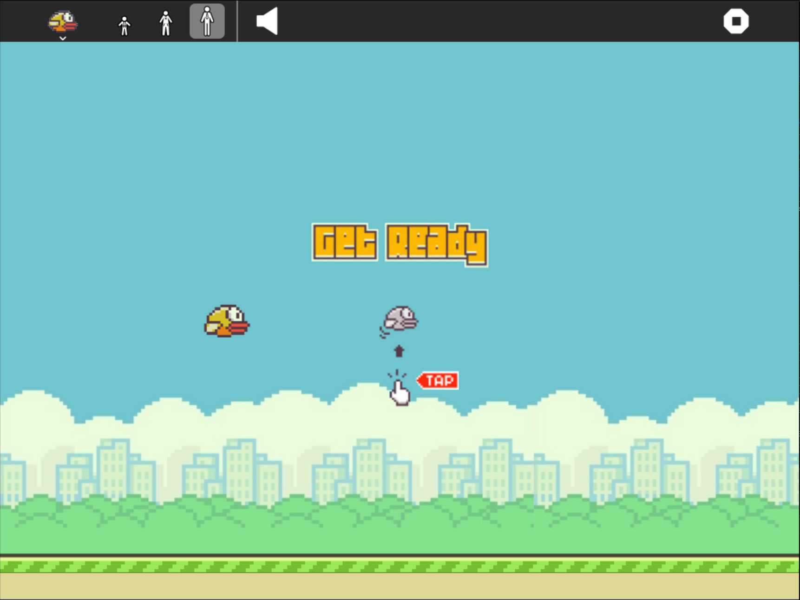

What is this?
=============

Flappy is an arcade game for the Sugar desktop.



How to use?
===========

Flappy Birds is not part of the Sugar desktop, but can be added.  Please refer to;

* [How to Get Sugar on sugarlabs.org](https://sugarlabs.org/),
* [How to use Sugar](https://help.sugarlabs.org/),
* [Download Flappy using Browse](https://v4.activities.sugarlabs.org/), search for `Flappy`, then download, and;
* Refer the 'How to play' section inside the activity

How to upgrade?
===============

On Sugar desktop systems;
* use [My Settings](https://help.sugarlabs.org/my_settings.html), [Software Update](https://help.sugarlabs.org/my_settings.html#software-update), or;
* use Browse to open [v4.activities.sugarlabs.org](https://v4.activities.sugarlabs.org/), search for `Flappy`, then download.

How to run?
=================

Flappy depends on Python, PyGTK and PyGame.

Flappy is started by [Sugar](https://github.com/sugarlabs/sugar).

Flappy is not packaged by Debian, Ubuntu and Fedora distributions.  
On Ubuntu and Debian systems these required dependencies (`gir1.2-gtk-3.0` and
`python3-pygame-sdl2`) need to be manually installed.
On Fedora system these dependencies (`gtk3` and `python3-pygame`) need to be manually installed.


**Running outside Sugar**


- Install the dependencies - 

On Debian and Ubuntu systems;

```
sudo apt install gir1.2-gtk-3.0 python3-pygame-sdl2
```

On Fedora systems;

```
sudo dnf install gtk3 python3-pygame
```

- Clone the repo and run-
```
git clone https://github.com/sugarlabs/flappy.git
cd flappy
python3 main.py
```

**Running inside Sugar**

- Activity can be run from the activity ring, you'll open
  terminal activity and change to the flappy activity directory
```
cd Activities/flappy
# Set up activity for development 
python3 setup.py dev
```
- Go to activity ring and search for flappy and run.

- Activity can also be run from the terminal by running while in
  activity directory
```
sugar-activity3 .
```
